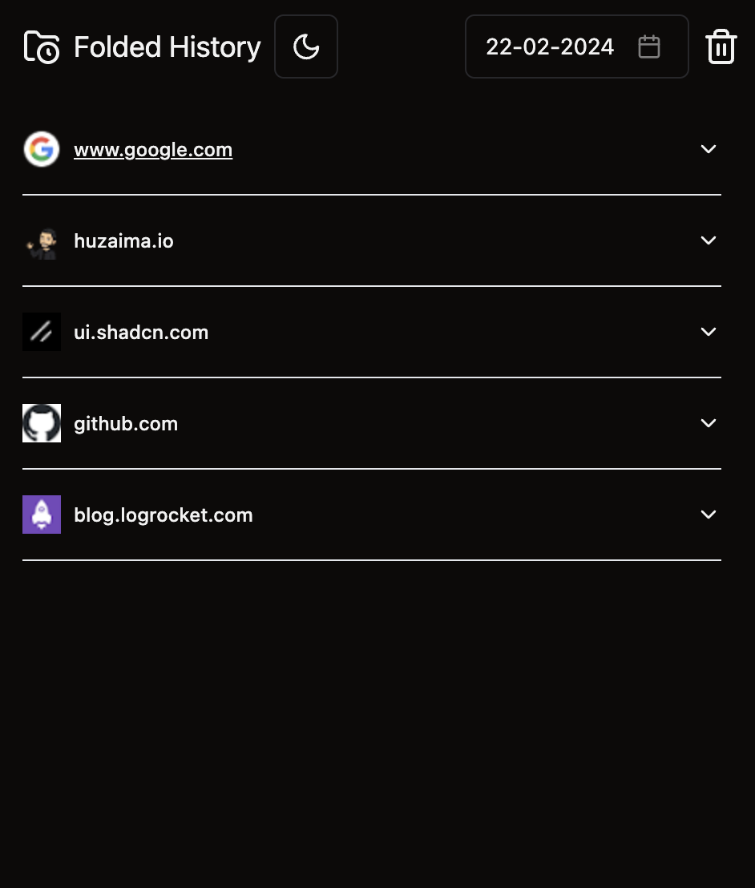

# Folded History

Folded History is a Chrome extension that provides an organized view of your browsing history, allowing you to navigate through your visited websites in a structured folder format. Instead of a traditional linear list, Folded History categorizes your browsing history based on domains, making it easier to find and revisit specific websites

  

## Prerequisites

To use Folded History, you need to have the following installed:

- A Chromium-based web browser (e.g., Google Chrome, Microsoft Edge)

## How to Install

To install the Folded History extension, follow these steps:

Currently it is not available on the Chrome Web store

1. Visit [Github Releases](https://github.com/Manethpak/folded-history/releases) page and download the latest version.
2. Go to chrome [extension management](chrome://extensions/) and turn on developer mode.
3. Select Load unpacked and upload the folder that you have have downloaded.
